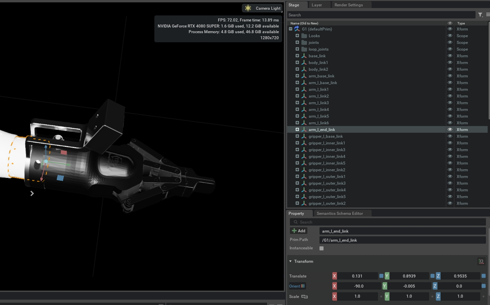
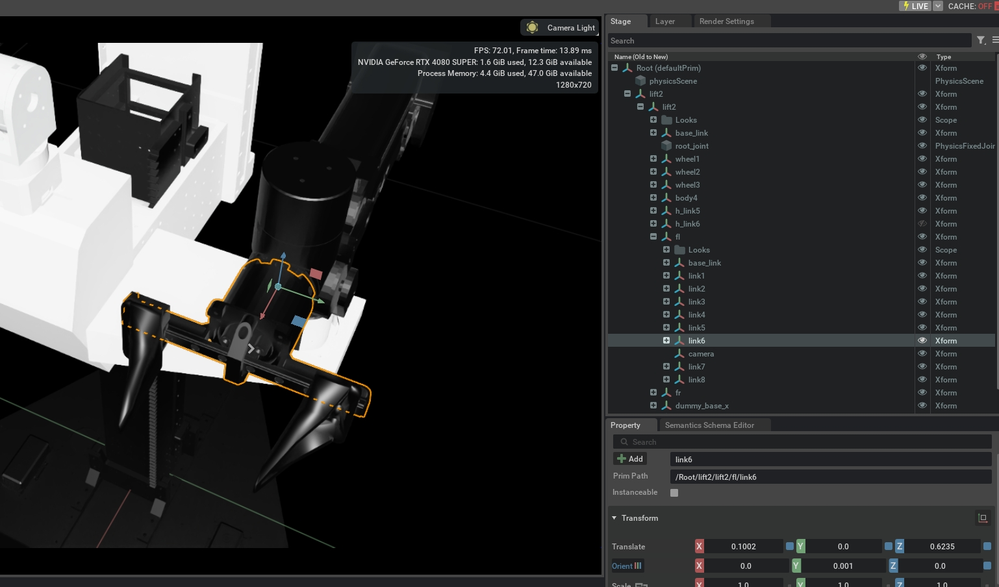
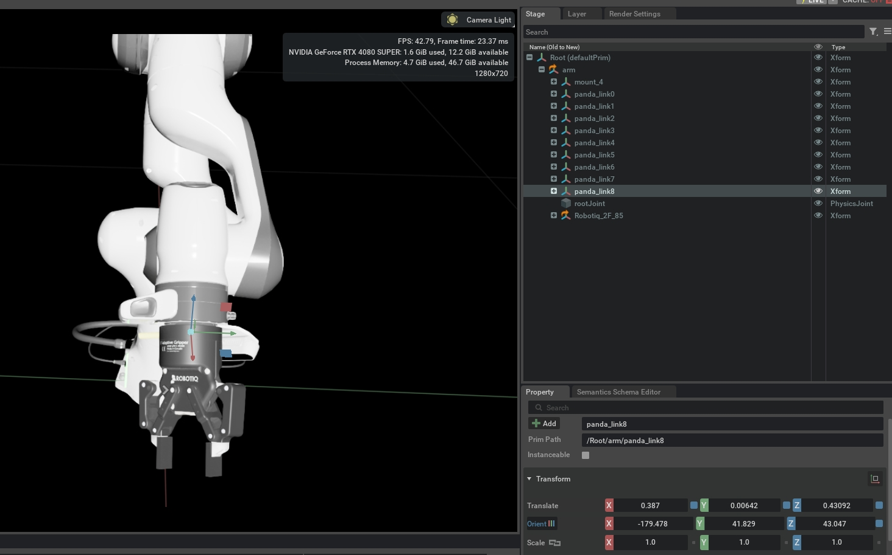
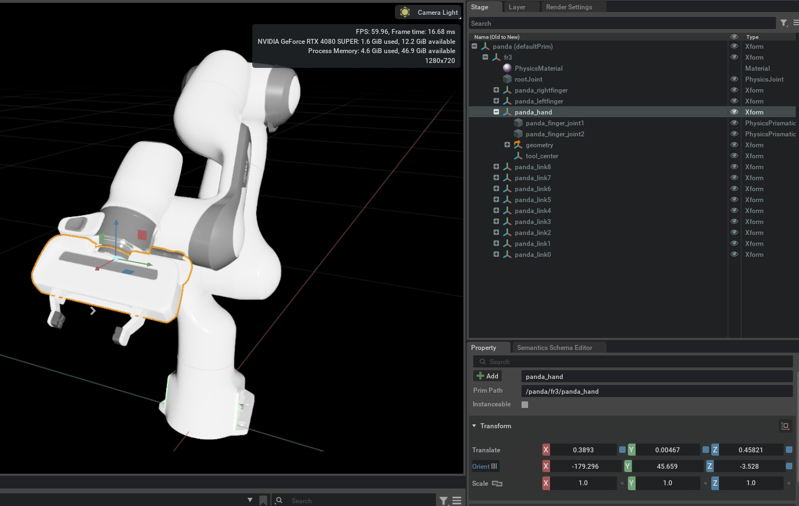

# New Robot

This guide explains how to add a new robot platform to InternDataEngine.

## Part 1: Obtain Robot USD

We recommend converting **URDF to USD** for robot assets. Isaac Sim provides a URDF Importer that converts URDF files to USD format.

### Requirements for the USD File

1. **Physics Properties**: Ensure the USD has proper physics attributes - joint angles should move correctly when set, and dynamics parameters (damping, stiffness) should be configured appropriately.

2. **Collision Mesh**: Use **convex hull** collision meshes rather than convex decomposition. Convex decomposition creates many collision shapes, which significantly slows down motion planning and interaction physics.

3. **Joint Locking (Dual-arm Robots)**: For dual-arm robots, we recommend locking all joints except the two arm joints and gripper joints to simplify experiments and planning.

<div class="custom-tip">
<p class="custom-tip-title">Hint</p>
<p class="custom-tip-content">Isaac Sim's default URDF Importer typically produces stable USD files. However, URDF files themselves may have issues, and some damping/stiffness parameters might need adjustment after conversion.</p>
</div>

<div class="custom-warning">
<p class="custom-warning-title">Warning</p>
<p class="custom-warning-content">Some grippers have underactuated joints (passive/follower joints) with a forward extension offset. These may exhibit undesirable physical interactions with objects. Test thoroughly before proceeding.</p>
</div>

Good luck obtaining a physically stable robot USD!


## Part 2: Create Robot YAML Configuration

Create a robot configuration file in `workflows/simbox/core/configs/robots/`. Here's a template `new_robot.yaml`:

```yaml
# =============================================================================
# New Robot Configuration Template
# =============================================================================
# Description: [e.g., Dual-arm 6-DOF robot with lift joint]

# -----------------------------------------------------------------------------
# Robot Info
# -----------------------------------------------------------------------------
target_class: NewRobot                    # Python class name for robot wrapper
path: "YOUR_PATH_TO_ROBOT_USD_PATH (relative to asset root)"                                  # USD file path relative to asset root

# -----------------------------------------------------------------------------
# CuRobo Kinematics Config (one per arm for dual-arm robots)
# -----------------------------------------------------------------------------
robot_file:
  - ""                                    # Left arm CuRobo config path
  - ""                                    # Right arm CuRobo config path (dual-arm only)

# -----------------------------------------------------------------------------
# Gripper Parameters
# -----------------------------------------------------------------------------
gripper_max_width: 0.0                    # Maximum gripper opening (meters)
gripper_min_width: 0.0                    # Minimum gripper closing (meters)
tcp_offset: 0.0                           # Distance from EE origin to TCP (meters, MUST be positive)

# -----------------------------------------------------------------------------
# Physics Solver Parameters
# -----------------------------------------------------------------------------
solver_position_iteration_count: 128      # Position solver iterations
solver_velocity_iteration_count: 4         # Velocity solver iterations
stabilization_threshold: 0.005            # Stabilization threshold

# -----------------------------------------------------------------------------
# Joint Indices (find in Isaac Sim's articulation inspector)
# -----------------------------------------------------------------------------
left_joint_indices: []                    # Left arm joint indices, e.g., [0, 1, 2, 3, 4, 5]
right_joint_indices: []                   # Right arm joint indices (dual-arm only)
left_gripper_indices: []                  # Left gripper joint index, e.g., [6]
right_gripper_indices: []                 # Right gripper joint index (dual-arm only)
lift_indices: []                          # Lift joint indices (if applicable)

# -----------------------------------------------------------------------------
# End-Effector Paths (relative to robot prim path)
# IMPORTANT: Transformation from EE to TCP must be FIXED!
# -----------------------------------------------------------------------------
fl_ee_path: ""                            # Front-left end-effector prim path
fr_ee_path: ""                            # Front-right end-effector prim path (dual-arm only)
fl_base_path: ""                          # Front-left base prim path
fr_base_path: ""                          # Front-right base prim path (dual-arm only)

# -----------------------------------------------------------------------------
# Gripper Keypoints (in EE frame, for visualization)
# -----------------------------------------------------------------------------
fl_gripper_keypoints:
  tool_head: [0.0, 0.0, 0.0, 1]           # Gripper fingertip (approach direction)
  tool_tail: [0.0, 0.0, 0.0, 1]           # Gripper base
  tool_side: [0.0, 0.0, 0.0, 1]           # Side point for width visualization
fr_gripper_keypoints:
  tool_head: [0.0, 0.0, 0.0, 1]
  tool_tail: [0.0, 0.0, 0.0, 1]
  tool_side: [0.0, 0.0, 0.0, 1]

# -----------------------------------------------------------------------------
# Collision Filter Paths (relative to robot prim path)
# -----------------------------------------------------------------------------
fl_filter_paths:                          # Gripper fingers to filter from collision
  - ""
fr_filter_paths:
  - ""
fl_forbid_collision_paths:                # Arm links forbidden for self-collision
  - ""
fr_forbid_collision_paths:
  - ""

# -----------------------------------------------------------------------------
# Pose Processing Parameters
# -----------------------------------------------------------------------------
# Rotation matrix from GraspNet gripper frame to robot EE frame
# See: doc/InterDataEngine-docs/concepts/robots.md#r-ee-graspnet
R_ee_graspnet: [[0.0, 0.0, 0.0], [0.0, 0.0, 0.0], [0.0, 0.0, 0.0]]
ee_axis: ""                               # Approach axis from EE to TCP: "x", "y", or "z"

# -----------------------------------------------------------------------------
# Default Joint Home Positions (radians)
# -----------------------------------------------------------------------------
left_joint_home: []                       # Default left arm joint positions
right_joint_home: []                      # Default right arm joint positions (dual-arm only)
left_joint_home_std: []                   # Randomization std for left arm
right_joint_home_std: []                  # Randomization std for right arm (dual-arm only)
left_gripper_home: []                     # Default left gripper width (meters)
right_gripper_home: []                    # Default right gripper width (meters, dual-arm only)
lift_home: []                             # Default lift position (if applicable)
```

Refer to [Robots](/concepts/robots.md) for detailed explanations of each parameter. Here we highlight several critical parameters that require special attention:

### Critical Parameters

<p class="method-name">fl_ee_path / fr_ee_path</p>
<div class="method-block">

Specify the relative path (under the robot's local prim path) to the end-effector link.

<p class="method-section">Why It Matters: </p>

- CuRobo plans target poses for this link
- Grasp poses are transformed based on this link's EE pose
- The `ee_axis` (approach direction from EE origin to TCP) depends on this link

<p class="method-section">Selection Rule: </p>


Common choices:
- The last link of the gripper (e.g., Robotiq, Genie-1)
- A link on the gripper (e.g., Lift-2, Panda)

<div class="custom-warning">
<p class="custom-warning-title">Warning</p>
<p class="custom-warning-content">The transformation from EE to TCP must be <strong>FIXED</strong> (fixed rotation + fixed translation = tcp_offset).</p>
</div>

Figure Examples:

<p align="center">
  <a href="../public/ee_genie1.jpg" target="_blank">
    
  </a>
</p>
<p align="center"><em>Genie-1: EE link is the last gripper link (fixed EE-to-TCP transform)</em></p>

<p align="center">
  <a href="../public/ee_lift2.jpg" target="_blank">
    
  </a>
</p>
<p align="center"><em>Lift-2: EE link is a gripper link (fixed EE-to-TCP transform)</em></p>

<p align="center">
  <a href="../public/ee_robotiq.jpg" target="_blank">
    
  </a>
</p>
<p align="center"><em>Robotiq: EE link is the last gripper link (fixed EE-to-TCP transform)</em></p>

<p align="center">
  <a href="../public/ee_panda.jpg" target="_blank">
    
  </a>
</p>
<p align="center"><em>Panda: EE link is a gripper link (fixed EE-to-TCP transform)</em></p>

</div>


<p class="method-name">tcp_offset</p>
<div class="method-block">

Once `fl_ee_path` is determined, calculate the distance from EE origin to TCP. This should be a **positive value**.

Config Example:
```yaml
# Example: ARX Lift-2
tcp_offset: 0.125  # Distance in meters from EE frame origin to TCP
```

</div>


<p class="method-name">ee_axis</p>
<div class="method-block">

The axis direction from EE origin pointing toward TCP, expressed in the EE frame. Valid values are `"x"`, `"y"`, or `"z"`.

Config Example:
```yaml
# Example: ARX Lift-2
ee_axis: "x"  # Approach direction in EE frame
```

</div>


<p class="method-name">R_ee_graspnet</p>
<div class="method-block">

The rotation matrix that transforms from the GraspNet API's canonical gripper frame to the robot's end-effector frame.

<div class="custom-warning">
<p class="custom-warning-title">Warning</p>
<p class="custom-warning-content">This parameter is important but can be tricky! For calculation details, refer to <a href="/concepts/robots.html#r-ee-graspnet">Robots - R_ee_graspnet</a>.</p>
</div>

Config Example:
```yaml
# Example: ARX Lift-2
R_ee_graspnet: [[1.0, 0.0, 0.0], [0.0, -1.0, 0.0], [0.0, 0.0, -1.0]]
```

</div>

## Part 3: Create Robot Python Class

Create a Python file in `workflows/simbox/core/robots/`. Here's a template based on `lift2.py`:

```python
"""New robot implementation."""
import numpy as np
from core.robots.base_robot import register_robot
from core.robots.template_robot import TemplateRobot


@register_robot
class NewRobot(TemplateRobot):
    """New robot implementation."""

    def _setup_joint_indices(self):
        """Configure joint indices from config."""
        self.left_joint_indices = self.cfg["left_joint_indices"]
        self.right_joint_indices = self.cfg["right_joint_indices"]
        self.left_gripper_indices = self.cfg["left_gripper_indices"]
        self.right_gripper_indices = self.cfg["right_gripper_indices"]
        # Optional: lift, body, head indices for special robots
        self.lift_indices = self.cfg.get("lift_indices", [])

    def _setup_paths(self):
        """Configure USD prim paths from config."""
        fl_ee_path = self.cfg["fl_ee_path"]
        fr_ee_path = self.cfg["fr_ee_path"]
        self.fl_ee_path = f"{self.robot_prim_path}/{fl_ee_path}"
        self.fr_ee_path = f"{self.robot_prim_path}/{fr_ee_path}"
        self.fl_base_path = f"{self.robot_prim_path}/{self.cfg['fl_base_path']}"
        self.fr_base_path = f"{self.robot_prim_path}/{self.cfg['fr_base_path']}"
        self.fl_hand_path = self.fl_ee_path
        self.fr_hand_path = self.fr_ee_path

    def _setup_gripper_keypoints(self):
        """Configure gripper keypoints from config."""
        self.fl_gripper_keypoints = self.cfg["fl_gripper_keypoints"]
        self.fr_gripper_keypoints = self.cfg["fr_gripper_keypoints"]

    def _setup_collision_paths(self):
        """Configure collision filter paths from config."""
        self.fl_filter_paths_expr = [
            f"{self.robot_prim_path}/{p}" for p in self.cfg["fl_filter_paths"]
        ]
        self.fr_filter_paths_expr = [
            f"{self.robot_prim_path}/{p}" for p in self.cfg["fr_filter_paths"]
        ]
        self.fl_forbid_collision_paths = [
            f"{self.robot_prim_path}/{p}" for p in self.cfg["fl_forbid_collision_paths"]
        ]
        self.fr_forbid_collision_paths = [
            f"{self.robot_prim_path}/{p}" for p in self.cfg["fr_forbid_collision_paths"]
        ]

    def _get_gripper_state(self, gripper_home):
        """
        Determine gripper open/close state.

        Returns:
            1.0 if gripper is open, -1.0 if closed.
        """
        # Adjust threshold based on your gripper's joint values
        #  return 1.0 if gripper_home and gripper_home[0] >= value else -1.0
        pass

    def _setup_joint_velocities(self):
        """Configure joint velocity limits (optional)."""
        # Override if needed for custom velocity limits
        pass

    def apply_action(self, joint_positions, joint_indices, *args, **kwargs):
        """Override for custom action application (optional)."""
        super().apply_action(joint_positions, joint_indices, *args, **kwargs)
```

### Key Methods

<p class="method-name">_get_gripper_state(self, gripper_home)</p>
<div class="method-block">

Determine whether the gripper is open or closed based on the current joint positions.

<p class="method-section">Parameters: </p>

- **gripper_home** (<span class="param-type">list</span>): Current gripper joint positions.

<p class="method-section">Returns: </p>

- **float**: `1.0` if gripper is open, `-1.0` if closed.

<div class="custom-tip">
<p class="custom-tip-title">Hint</p>
<p class="custom-tip-content">Adjust the threshold value based on your gripper's specific joint values. Different grippers have different open/close positions.</p>
</div>

Code Example:

```python
# Example 1: ARX Lift-2 (single-joint parallel gripper)
# Gripper is open when joint value >= 0.044 (44mm)
def _get_gripper_state(self, gripper_home):
    return 1.0 if gripper_home and gripper_home[0] >= 0.044 else -1.0

# Example 2: Franka with Robotiq 2F-85 (two-joint gripper)
# Gripper is open when both joints are 0.0
def _get_gripper_state(self, gripper_home):
    if not gripper_home or len(gripper_home) < 2:
        return 1.0
    return 1.0 if (gripper_home[0] == 0.0 and gripper_home[1] == 0.0) else -1.0
```

</div>

### Register the Robot

Add your robot to `workflows/simbox/core/robots/__init__.py`:

```python
from core.robots.new_robot import NewRobot

__all__ = [
    # ... existing robots
    "NewRobot",
]
```


## Part 4: Create Task Robot Configuration

Add the robot configuration to your task YAML file:

```yaml
robots:
  - name: "new_robot"
    robot_config_file: workflows/simbox/core/configs/robots/new_robot.yaml
    euler: [0.0, 0.0, 0.0]  # Initial orientation [roll, pitch, yaw] in degrees
    ignore_substring: ["material", "table"]  # Collision filter substrings
```

See [YAML Configuration](/config/yaml.md) for more details on task configuration.


## Checklist

- [ ] Obtain or create robot USD file (URDF → USD via Isaac Sim)
- [ ] Verify physics properties (joint movement, damping, stiffness)
- [ ] Set up collision meshes (use convex hull, not convex decomposition)
- [ ] Lock unnecessary joints for dual-arm robots
- [ ] Create robot YAML config file in `workflows/simbox/core/configs/robots/`
- [ ] Configure `fl_ee_path` / `fr_ee_path` (EE link with fixed EE-to-TCP transform)
- [ ] Calculate and set `tcp_offset` (distance from EE origin to TCP)
- [ ] Determine `ee_axis` (approach direction: "x", "y", or "z")
- [ ] Calculate `R_ee_graspnet` (rotation from GraspNet frame to EE frame)
- [ ] Configure joint indices (`left_joint_indices`, `right_joint_indices`, etc.)
- [ ] Set up gripper keypoints for visualization
- [ ] Configure collision filter paths
- [ ] Create robot Python class in `workflows/simbox/core/robots/`
- [ ] Implement `_setup_joint_indices()`
- [ ] Implement `_setup_paths()`
- [ ] Implement `_setup_gripper_keypoints()`
- [ ] Implement `_setup_collision_paths()`
- [ ] Implement `_get_gripper_state()` (1.0 = open, -1.0 = closed)
- [ ] Register robot in `__init__.py`
- [ ] Add robot to task YAML configuration
- [ ] Test robot in simulation